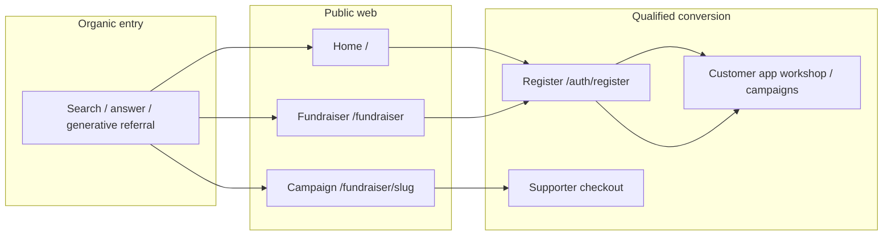

# TTW-070 — Organic discovery strategy brief (interim v1, slice 1)

This brief is the working source of truth for organic discovery planning across SEO, AEO and GEO. It records approved audiences, Nigeria-first market boundaries, query/entity maps, baseline metrics, prioritization rules and content ownership. It does **not** promise rankings, rich results, citations or traffic. Implementation of metadata, pages, schema and analytics belongs to TTW-071–TTW-078.

## Authority

| Rule             | Value                                                                                      |
| ---------------- | ------------------------------------------------------------------------------------------ |
| Product scope    | Nigeria-only v1; NGN; Paystack; domestic fulfilment per PRD and interim policy docs        |
| Evidence         | Public repo routes and copy are cited; third-party volume/SERP tools are directional only  |
| Canonical intent | One preferred public destination per priority query cluster (no duplicate competing pages) |
| Non-goals        | Paid acquisition, international SEO, ranking guarantees, crawler-only or hidden content    |
| Formal sign-off  | Product + marketing approval recorded in ticket before production go-live claims           |

## Priority audiences

| Audience id | Segment                                      | Primary need                                       | Serviceable in v1 | Conversion goal                         |
| ----------- | -------------------------------------------- | -------------------------------------------------- | ----------------- | --------------------------------------- |
| `ORG-BULK`  | Event/community organisers, teams, schools   | Bulk custom apparel with design + order management | Yes (NG)          | Register → design workshop → paid order |
| `ORG-FUND`  | Fundraising organisers (NGOs, clubs, causes) | Launch merch fundraiser with payouts               | Yes (NG)          | Register → campaign publish → organiser |
| `SUP-FUND`  | Supporters / donors                          | Buy campaign merch or support a cause              | Yes (NG)          | Campaign page → checkout → paid order   |
| `B2B-TEAM`  | SMB branded merch buyers                     | Repeatable branded apparel procurement             | Partial           | Register → bulk order journey           |

Secondary audiences (deferred targeting): international diaspora gifting, non-English-first communities, agency/reseller white-label.

## Markets and languages (Nigeria-first)

| Dimension        | v1 decision                                 | Rationale                                              | Deferred                          |
| ---------------- | ------------------------------------------- | ------------------------------------------------------ | --------------------------------- |
| Country          | Nigeria (`NG`)                              | PRD Nigeria-only shipping/payments                     | West Africa expansion             |
| Currency         | `NGN`                                       | Paystack + pricing policy (TTW-024)                    | Multi-currency storefront         |
| Language         | English (`en-NG`)                           | All current public copy; support capability            | Hausa, Yoruba, Igbo landing tests |
| Fulfilment       | Domestic Nigeria                            | Shipping/returns policies (TTW-040, TTW-041)           | Cross-border delivery             |
| Legal/compliance | Nigerian consumer + fundraising disclosures | Interim fundraising/payout policies (TTW-031, TTW-042) | Regional counsel matrix           |

Geo targeting in search must not claim service outside documented fulfilment, currency and support capability.

## Channel definitions

### SEO (Search Engine Optimization)

Optimizing **crawlable, indexable HTML** so human searchers find truthful Tamiym pages for qualified intents. Includes technical foundations (canonicals, robots, sitemaps, metadata), on-page relevance, internal linking and measurable index coverage.

**Can measure (with caveats):** index status, impressions, clicks, average position (GSC/Bing), branded vs non-branded split, landing-page engagement, organic-attributed registrations/orders when consent and tooling exist.

**Cannot reliably measure:** guaranteed ranking positions, competitor share-of-voice without paid tools, revenue solely attributable to SEO without multi-touch modelling.

**Owning tickets:** TTW-071 (technical), TTW-072 (IA/content), TTW-076 (CWV), TTW-077 (dashboards), TTW-078 (regression gates).

### AEO (Answer Engine Optimization)

Publishing **direct, concise, evidence-backed answers** on public pages so users and applicable answer/rich-result experiences can extract useful facts without leaving misleading fragments.

**Can measure:** FAQ/how-to rich-result eligibility checks, People Also Ask coverage in sampled audits, on-page answer completeness reviews, assisted conversions from answer landing pages.

**Cannot reliably measure:** which answer engine selected Tamiym text, stable citation share across AI Overviews/featured snippets.

**Owning tickets:** TTW-074 (answer-ready content), TTW-073 (supported schema), TTW-078 (regression).

### GEO (Generative Engine Optimization)

Ensuring **accurate entity representation and citation-ready evidence** for generative discovery systems: consistent brand/organization facts, dated policies, visible pricing/fulfilment boundaries, and authoritative internal links.

**Can measure:** entity consistency audits, structured-data validity, brand mention accuracy in periodic sampled prompts (manual), referral logs where available.

**Cannot reliably measure:** training inclusion, stable generative citations, ranking inside third-party models.

**Owning tickets:** TTW-073 (JSON-LD), TTW-075 (AI crawler governance), TTW-074 (evidence-backed copy).

## Public URL and message inventory (2026-08-22)

| Path                          | Indexable (target) | Primary message                            | Entity / claim risks                                       | Canonical owner   | Gap / ticket     |
| ----------------------------- | ------------------ | ------------------------------------------ | ---------------------------------------------------------- | ----------------- | ---------------- |
| `/`                           | Yes                | Bulk custom apparel + workshop + fundraise | CTAs route to register, not catalog; broad keyword overlap | Product/Marketing | TTW-072, TTW-074 |
| `/about`                      | Yes                | Event merch quality + mission              | Limited proof points, no policy links                      | Product/Marketing | TTW-072, TTW-074 |
| `/fundraiser`                 | Yes                | Fundraise with custom merch                | "No upfront costs", "risk-free" need policy alignment      | Fundraising PM    | TTW-072, TTW-074 |
| `/fundraiser/[slug]`          | Conditional        | Live campaign offers                       | No route metadata/index rules yet; unapproved must noindex | Engineering + API | TTW-071, TTW-031 |
| `/fundraiser/[slug]/checkout` | No                 | Supporter checkout                         | Transactional; auth/payment state                          | Engineering       | TTW-071          |
| `/auth/*`                     | No                 | Account access                             | Must not leak campaign/order context                       | Engineering       | TTW-071          |
| `/orders/[id]/confirm`        | No                 | Post-payment confirmation                  | Private order state                                        | Engineering       | TTW-071          |
| `/verify-email`               | No                 | Email verification                         | Account security                                           | Engineering       | TTW-071          |

**Current technical baseline:** only global `title`/`description` in `apps/web/app/layout.tsx`; no per-route metadata, sitemap, robots or Search Console integration (see epic `docs/epics/07-organic-discovery-seo-aeo-geo.md`).

## Query clusters and preferred destinations

| Cluster id   | Representative intents (non-exhaustive)                       | Preferred destination (v1)     | Funnel stage  | Priority score | Ticket sequence  |
| ------------ | ------------------------------------------------------------- | ------------------------------ | ------------- | -------------- | ---------------- |
| `Q-BRAND`    | tamiym workshop, tamiym merch                                 | `/` (brand home)               | Navigational  | 18             | TTW-071          |
| `Q-BULK`     | bulk custom t shirts Nigeria, event merch printing Lagos      | `/` + future `/solutions/bulk` | Consideration | 16             | TTW-072, TTW-074 |
| `Q-DESIGN`   | online t shirt design tool Nigeria, custom apparel mockup     | `/` (workshop section)         | Consideration | 14             | TTW-072, TTW-074 |
| `Q-FUND`     | fundraiser merch platform Nigeria, charity t shirt fundraiser | `/fundraiser`                  | Consideration | 17             | TTW-072, TTW-074 |
| `Q-FUND-HOW` | how to run merch fundraiser, no inventory fundraising         | `/fundraiser` + guide (future) | Evaluation    | 15             | TTW-074          |
| `Q-SUPPORT`  | campaign [name] merch, buy [cause] shirt                      | `/fundraiser/[slug]`           | Transactional | 13             | TTW-071, TTW-073 |
| `Q-TRUST`    | tamiym returns, tamiym pricing, is tamiym legit               | Policy/pricing pages (future)  | Evaluation    | 12             | TTW-072, TTW-074 |

**Cannibalization rule:** do not create separate URLs for `Q-BULK` and `Q-DESIGN` until `/` sections are consolidated under TTW-072; use one hub page with clear internal anchors first.

**Evidence note:** keyword phrasing is directional from public copy and category knowledge (2026-08-22). Volume estimates from third-party tools are not product truth.

## Entity map

| Entity type    | Canonical name  | Public surface (current / target) | Authoritative source                     | Schema ticket |
| -------------- | --------------- | --------------------------------- | ---------------------------------------- | ------------- |
| Organization   | Tamiym Workshop | `/`, `/about`, future footer NAP  | Product/legal approved business facts    | TTW-073       |
| WebSite        | Public web app  | `/`                               | Production `WEB_PUBLIC_ORIGIN` (TTW-071) | TTW-073       |
| Product        | Apparel SKUs    | Campaign pages; future catalogue  | API product catalog                      | TTW-073       |
| Offer          | Campaign offers | `/fundraiser/[slug]`              | Approved campaign revision (TTW-031)     | TTW-073       |
| Service        | Fundraising     | `/fundraiser`                     | Fundraising interim policies             | TTW-073       |
| Policy         | Returns/refunds | Not yet public                    | TTW-041 interim policy                   | TTW-072/074   |
| Policy         | Payouts/KYC     | Organiser app (not public SEO)    | TTW-042 interim policy                   | —             |
| Person         | Organiser       | Non-indexable account surfaces    | Auth boundaries                          | —             |
| Customer order | Order           | `/orders/*` non-indexable         | TTW-033                                  | —             |

## Public conversion journeys (organic entry)

| Journey id     | Entry cluster   | Steps                                                | Qualified outcome     | Attribution caveat                         |
| -------------- | --------------- | ---------------------------------------------------- | --------------------- | ------------------------------------------ |
| `J-ORG-START`  | Q-BULK/Q-DESIGN | Organic → `/` → register → app onboarding            | New organiser account | Last-click undervalues multi-touch         |
| `J-FUND-START` | Q-FUND          | Organic → `/fundraiser` → register → campaign wizard | Published campaign    | Campaign publish is leading indicator      |
| `J-SUPPORT`    | Q-SUPPORT       | Organic → `/fundraiser/[slug]` → checkout            | Paid supporter order  | Campaign slug may be brand-heavy long-tail |

## Baseline metrics catalogue (versioned)

**Catalogue id:** `discovery-metrics/v1-interim-2026-08-22`\
**Timezone:** `Africa/Lagos` (align with TTW-036 analytics windows)\
**Review cadence:** monthly product + engineering review; weekly during TTW-071–078 rollout

| Metric id                 | Definition                                              | Source (target)         | Baseline (2026-08-22)  | Attribution limits                   |
| ------------------------- | ------------------------------------------------------- | ----------------------- | ---------------------- | ------------------------------------ |
| `idx_pages`               | Count of indexable public URLs with 200 + index allowed | GSC/Bing, crawl audit   | Not instrumented       | Vendor delay; filter staging domains |
| `idx_errors`              | Coverage errors / excluded critical pages               | GSC/Bing                | Not instrumented       |                                      |
| `seo_impressions`         | Search impressions for verified property                | GSC                     | Not instrumented       | Query sampling; brand bias           |
| `seo_clicks`              | Search clicks                                           | GSC                     | Not instrumented       |                                      |
| `seo_ctr`                 | `seo_clicks / seo_impressions`                          | Derived                 | Not instrumented       | Low-volume variance                  |
| `organic_sessions`        | Sessions with organic search referrer                   | Web analytics (TTW-077) | Not instrumented       | Consent/cookie banner impact         |
| `organic_register`        | Registrations with organic landing or referrer          | Product analytics       | Not instrumented       | Cross-device loss                    |
| `organic_campaign_pub`    | Campaigns first published from organic landing          | Product DB + analytics  | Not instrumented       | Requires UTM discipline              |
| `organic_supporter_order` | Paid orders from organic campaign landings              | Order DB + analytics    | Not instrumented       |                                      |
| `schema_valid_rate`       | Share of priority URLs passing Rich Results test        | CI + manual audit       | 0% (no public JSON-LD) | Tooling ≠ ranking                    |
| `cwv_lcp_p75`             | LCP p75 on representative public routes                 | RUM/Lab (TTW-076)       | Not baselined          | Lab vs field divergence              |
| `aeo_answer_coverage`     | Priority questions with on-page direct answer + source  | Editorial audit         | 0/X (not scored yet)   | Manual rubric                        |
| `geo_entity_consistency`  | Sampled generative answers match entity map             | Manual prompt audit     | Not baselined          | Model volatility                     |

**Privacy:** no commit of private analytics exports; store evidence paths in ticket only.

## Prioritization model

Score each cluster or technical gap on four axes (1–5):

| Axis              | 1 (low)                  | 5 (high)                                    |
| ----------------- | ------------------------ | ------------------------------------------- |
| Business value    | Vanity traffic           | Directly drives register/campaign/order     |
| Evidence strength | Guess / tool volume only | Repo copy + policy + user journey proven    |
| Effort            | Single metadata change   | New IA, schema, content system, analytics   |
| Risk              | Reversible copy tweak    | Legal/claim conflict, privacy/index leakage |

**Priority score** = `business_value + evidence_strength + (6 - effort) + (6 - risk)` (range 4–20).

**Slice 1 ranked backlog (strategy only):**

| Rank | Item                                       | Score | Maps to     |
| ---- | ------------------------------------------ | ----- | ----------- |
| 1    | Crawl/index/canonical foundations          | 19    | TTW-071     |
| 2    | Fundraiser landing claims + evidence map   | 17    | TTW-072/074 |
| 3    | Public IA for bulk vs fundraise separation | 16    | TTW-072     |
| 4    | Organization + website JSON-LD             | 15    | TTW-073     |
| 5    | Answer library for fundraiser/how-it-works | 15    | TTW-074     |
| 6    | AI crawler policy                          | 14    | TTW-075     |
| 7    | CWV/media budgets on marketing routes      | 13    | TTW-076     |
| 8    | GSC/analytics metric wiring                | 13    | TTW-077     |
| 9    | CI/Playwright discovery regression suite   | 12    | TTW-078     |

Tie-break: prefer work that reduces legal/claim risk before volume chasing.

## Content owners and approval gates

| Claim domain              | Owner role        | Approver(s)           | Evidence required                       | Blocks public copy |
| ------------------------- | ----------------- | --------------------- | --------------------------------------- | ------------------ |
| Pricing / fees / VAT      | Finance + Product | Finance lead          | TTW-024 pricing policy, live rate cards | Yes                |
| Fulfilment / shipping SLA | Operations        | Ops lead              | TTW-040 shipment policy                 | Yes                |
| Returns / refunds         | Support + Legal   | Legal counsel         | TTW-041 interim policy                  | Yes                |
| Fundraising economics     | Fundraising PM    | Product + Finance     | TTW-031/034/042 policies                | Yes                |
| Payout / KYC statements   | Compliance        | Legal/compliance      | TTW-042 interim policy                  | Yes                |
| Brand positioning         | Marketing         | Product marketing     | Approved messaging doc                  | Yes                |
| Technical SEO / index     | Engineering       | Platform lead         | TTW-071 specs + staging verification    | No (technical)     |
| Structured data           | Engineering       | Product + Engineering | Visible-on-page parity audit (TTW-073)  | Yes                |

Unsupported claims on `/fundraiser` requiring correction before scaled discovery work:

| Claim (current)                        | Risk                           | Owner           | Tracking               |
| -------------------------------------- | ------------------------------ | --------------- | ---------------------- |
| "No upfront costs"                     | May omit organiser obligations | Fundraising PM  | TTW-074 content ticket |
| "Risk-free"                            | Legal superlative              | Legal/Marketing | TTW-074 content ticket |
| "We handle production and fulfillment" | Must match ops capability      | Operations      | TTW-072 IA ticket      |

## Competitor and content-gap notes (directional)

| Competitor archetype         | Overlap          | Tamiym differentiation (truthful)                   | Gap to close                        |
| ---------------------------- | ---------------- | --------------------------------------------------- | ----------------------------------- |
| Print-on-demand marketplaces | Custom merch     | Nigeria-first fulfilment + fundraising module       | Public pricing/SLA pages            |
| Global fundraiser platforms  | Campaign merch   | Integrated design workshop + domestic payout policy | Evidence-backed how-it-works guides |
| Local print shops            | Bulk event merch | Self-serve design + order dashboard                 | Local trust signals, case studies   |

No paid SERP tooling baseline is committed in slice 1; quarterly manual SERP sampling is deferred to TTW-077.

## Deferred items (explicit non-goals for slice 1)

| Item                                      | Reason deferred              | Owning ticket / note   |
| ----------------------------------------- | ---------------------------- | ---------------------- |
| Per-route metadata, sitemap, robots       | Implementation slice         | TTW-071                |
| JSON-LD / merchant schema                 | Needs IA + visible facts     | TTW-073                |
| Search Console / Bing verification        | Needs production origin      | TTW-077                |
| Web analytics organic dashboards          | Instrumentation not wired    | TTW-077                |
| `llms.txt` / AI training opt-outs         | Optional experiment          | TTW-075                |
| Hausa/Yoruba/Igbo localized landing pages | Support + translation budget | Post-v1                |
| Paid search / social ads                  | Out of epic scope            | —                      |
| International SEO hreflang                | No fulfilment                | Post-v1                |
| Automated rank tracking                   | Volatility + cost            | TTW-077 manual cadence |

## Roadmap mapping (TTW-071–TTW-078)

| Ticket  | Strategy outcome enabled by this brief                                       |
| ------- | ---------------------------------------------------------------------------- |
| TTW-071 | Index rules for table above; canonical origin; exclude auth/checkout/confirm |
| TTW-072 | Split bulk vs fundraise IA; policy pages; owner workflow                     |
| TTW-073 | Entity map → JSON-LD; offer/product parity with TTW-031                      |
| TTW-074 | Query clusters `Q-FUND-HOW`, `Q-TRUST`; claim corrections                    |
| TTW-075 | GEO crawler governance; generative reuse boundaries                          |
| TTW-076 | CWV baselines on `/`, `/fundraiser`, `/fundraiser/[slug]`                    |
| TTW-077 | Metric catalogue wiring; monthly review ritual                               |
| TTW-078 | Regression gates for metadata, schema, crawlability, privacy boundaries      |
