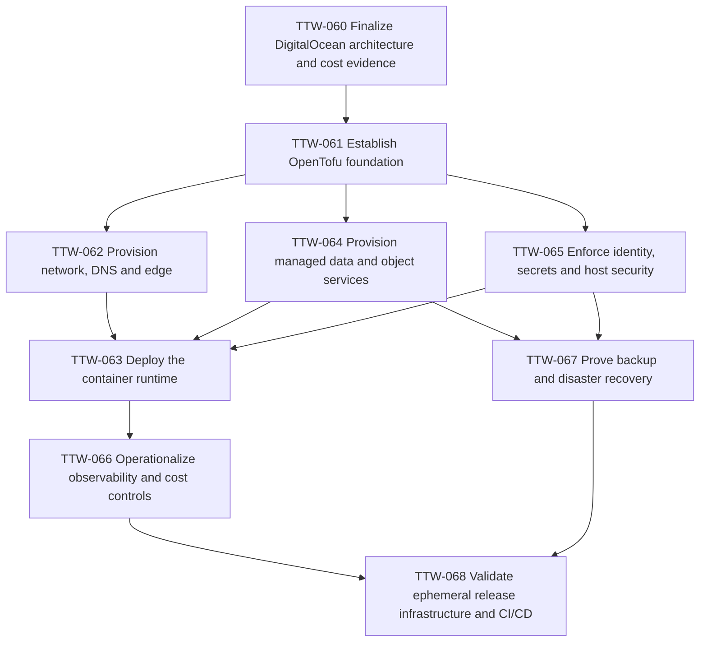

# Epic 6 — Production infrastructure as code

## Outcome

Provision a repeatable, cost-constrained DigitalOcean production environment from reviewed OpenTofu/HCL. The first release uses one application Droplet, Managed PostgreSQL and Spaces for a normal baseline below USD 50/month, with recoverable state, protected deployments and a tested path to scale.

## Current state

OpenTofu modules and isolated `production` / `temporary-validation` env roots, credential-free `validate-all.sh` policy gates, production Compose/Caddy/Valkey runtime contracts, backup/DR runbooks (TTW-067), and a dispatch-only **Release Candidate** workflow (TTW-068) that builds images (`push: false`), assembles a release manifest, and fails closed on live temporary-validation apply unless owner-gated. **Live DigitalOcean apply/deploy, registry digest publish, and TTW-050/051/053 gates against temporary real hosts remain residual / owner-gated.** Permanent staging is deferred. Production apply remains TTW-054.

Local development still uses Docker Compose (PostgreSQL, Redis/Valkey-compatible, MinIO). The API combines HTTP, BullMQ processors and cron schedulers in one NestJS process; production separates api/worker/scheduler containers on one Droplet.

ADR-001 selects DigitalOcean because the previously proposed AWS managed stack cannot meet the approved cost ceiling. **London is the primary region** after the TTW-060 Nigeria latency probe; Frankfurt is the recovery/fallback region. Namecheap remains the registrar and permanent staging is deferred.

## Scope

- Finalize the DigitalOcean architecture with current regional prices, latency evidence and cost/recovery trade-offs.
- Establish OpenTofu repository conventions, a proven remote-state/locking mechanism, validation and change controls.
- Provision a VPC, Cloud Firewall, reserved IP, Namecheap DNS/TLS integration and a hardened Droplet edge.
- Build immutable images and deploy separate web, customer, admin, API, worker and singleton-scheduler containers on one Droplet.
- Provision single-node DigitalOcean Managed PostgreSQL, Spaces and host-local Valkey with encryption, retention and access controls.
- Establish provider-token, SSH, runtime-secret, patching and break-glass controls appropriate to the DigitalOcean model.
- Route actionable application/infrastructure telemetry and enforce budget alerts.
- Automate managed and off-provider backups and prove rebuild/restore in the recovery region.
- Validate an immutable release using temporary resources and integrate CI/CD with the controlled production-release workflow.

## Explicit non-goals

- Implementing the rejected AWS production stack.
- A DigitalOcean Load Balancer, multiple application Droplets, managed Valkey, permanent staging or warm standby at launch.
- Claiming horizontal autoscaling or high availability that the sub-USD-50 topology does not provide.
- Deploying production without the explicit authorization required by TTW-054.
- Replacing application correctness, security, observability or browser acceptance work owned by TTW-010–TTW-053.

## Architecture principles

- Keep application contracts portable through containers, environment variables, OpenTelemetry and PostgreSQL/Redis/S3-compatible interfaces.
- Protect PostgreSQL as the authoritative business system of record; treat Valkey as reconstructable operational state.
- Use separate non-root containers, resource limits and internal networks even when workloads share one host.
- Expose only the reverse proxy and tightly restricted administration ports; never expose PostgreSQL or Valkey publicly.
- Keep state, secrets and generated plans out of git and retained CI artefacts.
- Require reviewed plans and owner approval for persistent production changes.
- Prefer predictable fixed costs; temporary validation resources must have automatic teardown and budget limits.
- Record thresholds that trigger vertical scaling, managed Valkey, a load balancer, multiple Droplets or provider reconsideration.

## Tickets and dependency graph

TTW-062, TTW-064 and TTW-065 can proceed in parallel after TTW-061 when their files do not overlap. TTW-063 integrates their outputs. TTW-068 is the epic exit gate and complements, rather than replaces, TTW-054.

## Epic acceptance criteria

- [x] ADR-001 records DigitalOcean selection and TTW-060 approves current pricing, primary region, latency, recovery, retention and operating assumptions.
- [x] OpenTofu reproducibly provisions the production and temporary-validation topology from isolated state with tested locking/recovery. → in-repo modules/envs + remote-state design; **live apply owner-gated**
- [x] CI runs formatting, validation, security and plan checks; production applies and deployments require owner approval. → `validate-all.sh`, `infra-plan.yml`, `release-candidate.yml` (dispatch only; no production auto-apply)
- [x] Only approved HTTPS and administration paths are public; PostgreSQL, Valkey, state and management endpoints are protected.
- [x] Immutable application containers run with explicit API, worker and singleton-scheduler responsibilities, safe health checks and controlled rollout.
- [x] Managed PostgreSQL, host Valkey and Spaces meet approved durability, encryption, retention and access requirements.
- [x] Operators can observe service health, queue pressure, dependency failure, backups, security signals and total cost.
- [ ] An isolated restore/rebuild exercise meets the approved recovery objectives or records an explicit owner-approved relaxation. → TTW-067 runbooks/policy in-repo; **live restore/DNS cutover owner-gated**
- [ ] The exact release candidate passes infrastructure, contract, telemetry and browser gates before an explicitly approved production change. → TTW-068 delivers infra release plumbing + manifest + credential-free infra gates; **TTW-050/051/053 against temporary real hosts remain residual / Scoped elsewhere**; live tmpval apply owner-gated; production change remains TTW-054
- [x] The measured normal low-traffic baseline remains below USD 50/month, with alerts and documented scale-up triggers. → cost model / budget docs (TTW-060/066); **live spend verification owner-gated**

## References

- `docs/18-production-infrastructure-options.md` — provider and cost comparison.
- `docs/19-digitalocean-production-architecture-decision.md` — accepted architecture, compromises and upgrade triggers.
- `docs/10-deployment-and-environments.md` — production deployment requirements.
- `docker-compose.yml` — current development-only topology.
- `apps/api/src/app.module.ts` — Redis/BullMQ and scheduler composition.
- `apps/api/src/storage/s3.service.ts` — S3-compatible storage contract.
- `.github/workflows/ci.yml` — current application checks and missing infrastructure/release jobs.
- `docs/tickets/ttw-051-operationalize-observability.md` — application telemetry requirements.
- `docs/tickets/ttw-054-rehearse-controlled-release.md` — production release authorization.
