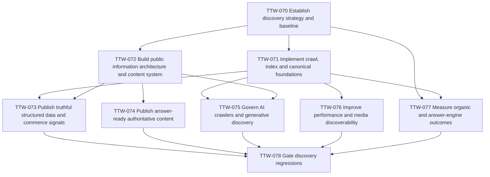

# Epic 7 — Organic discovery: SEO, AEO and GEO

## Outcome

Make Tamiym's public, approved content technically discoverable, useful for human searchers and easy for search and answer systems to interpret and cite. Establish truthful entity and commerce signals, answer-first content, measurable acquisition outcomes and automated regression protection without exposing private/customer data or promising rankings.

SEO covers conventional crawl, indexation, relevance and search appearance. AEO covers direct, concise answers that remain useful in-page and eligible for applicable answer/rich-result experiences. GEO covers accurate entity representation and citation-ready evidence for generative discovery systems. They share one content and technical foundation; this epic does not create separate crawler-only content.

## Current state

`apps/web` has a root title and description but no canonical base, per-route metadata system, sitemap, robots policy, structured data or search-console integration. Dynamic fundraiser pages render approved API data but do not generate route metadata or explicit indexation rules. The marketing site contains useful claims and content, but there is no documented query/entity strategy, editorial evidence model, answer library, merchant schema, Core Web Vitals budget or search regression suite.

## Scope

- Establish target audiences, markets, query clusters, entities, content ownership and measurable baselines.
- Encode canonical URLs, crawl/index rules, sitemaps, redirects and safe dynamic-page lifecycle behavior.
- Build a durable public information architecture and evidence-backed editorial workflow.
- Add truthful JSON-LD for the organization, website, navigation, content, products/offers and policies where supported by visible data.
- Publish concise answer-ready content with authorship, dates, sources and meaningful internal links.
- Govern search and AI crawlers explicitly, including independent search-versus-training choices.
- Improve renderability, accessibility, media discovery and Core Web Vitals.
- Connect Search Console/Bing and privacy-safe analytics to a versioned organic-discovery metric catalogue.
- Gate metadata, schema, crawlability, performance and public/private boundaries in CI and Playwright.

## Principles and invariants

- Optimize for users and truthful public facts, not crawler-specific prose, hidden content, doorway pages or fabricated authority.
- Structured data must describe visible page content and authoritative business state; markup cannot invent reviews, prices, availability, addresses, credentials or policies.
- Authentication, admin, checkout state, private designs, expired/unapproved fundraisers and tokenized share pages are not indexable.
- Canonicals, redirects, sitemaps, feeds and internal links agree on one preferred public URL per resource.
- SEO/AEO/GEO changes never weaken authorization, privacy, consent, rate limits or media controls.
- Search and answer-engine visibility is measured as an uncertain acquisition channel; no ticket guarantees ranking, rich results, citations or traffic.
- Emerging conventions such as `llms.txt` are optional experiments, not substitutes for accessible HTML, robots policy, sitemaps or structured data.

## Tickets and dependency graph

TTW-071 and TTW-072 may proceed in parallel after TTW-070. Product/offer markup in TTW-073 waits for the pricing, offer, shipping and return contracts it describes. TTW-078 is the epic exit gate and integrates with the existing Playwright and release-UAT work.

## Epic acceptance criteria

- [ ] Approved public URLs have unique server-rendered titles/descriptions, self-consistent canonicals, crawl/index directives, discoverable links and sitemap membership.
- [ ] Private, duplicate, inactive and unapproved surfaces are excluded consistently and tested against accidental disclosure/indexation.
- [ ] Visible organization, breadcrumb, content, product/offer and policy facts have valid JSON-LD only where authoritative source fields exist.
- [ ] Priority query clusters have useful landing or guide content with direct answers, evidence, ownership, review dates and internal journeys.
- [ ] Search and AI-crawler policy is explicit, independently configurable and monitored without deceptive bot-specific rendering.
- [ ] Core Web Vitals, accessibility and media-discovery budgets are measured on representative public routes and enforced with reviewed tolerances.
- [ ] Search/answer referrals, impressions, clicks, indexed coverage, rich-result/schema health and conversions have privacy-safe dashboards and review cadence.
- [ ] CI and Playwright block material metadata, schema, crawlability, performance and public/private-boundary regressions.

## References

- `apps/web/app/layout.tsx:5-13` — only global title/description/icon metadata exists.
- `apps/web/app/fundraiser/[slug]/page.tsx:12-24` — dynamic fundraiser pages have no route metadata or index lifecycle.
- `apps/web/lib/site.ts:1-18` — app URLs exist, but no canonical public-site origin contract exists.
- `docs/tickets/ttw-004-establish-playwright-foundation.md` — browser-test foundation.
- `docs/tickets/ttw-053-complete-release-browser-uat.md` — release-facing accessibility and browser coverage.
- [Google Search developer guide](https://developers.google.com/search/docs/fundamentals/get-started-developers)
- [Google structured-data guidelines](https://developers.google.com/search/docs/appearance/structured-data/sd-policies)
- [OpenAI crawler controls](https://developers.openai.com/api/docs/bots)
