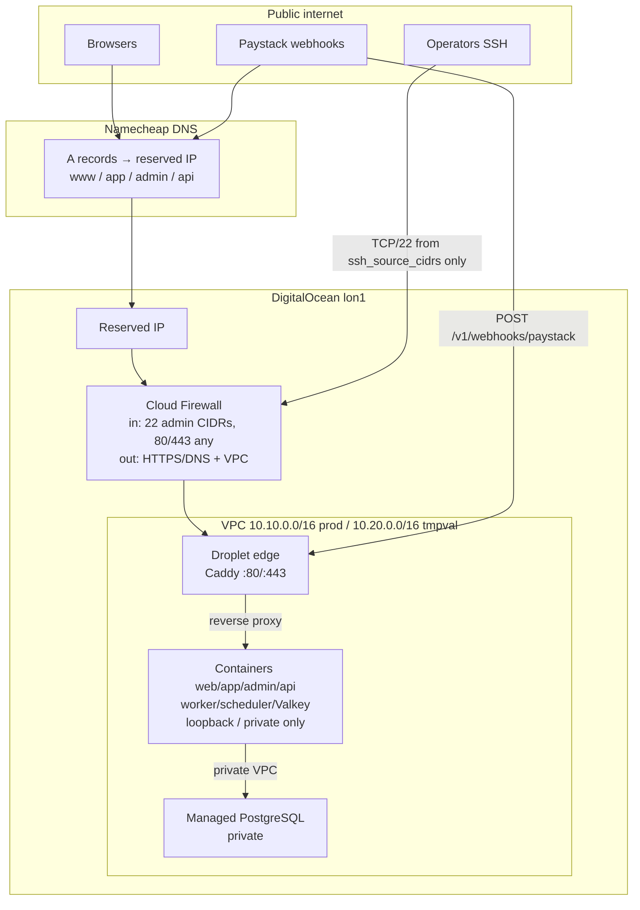

# TTW-062 — Network, DNS and edge

DigitalOcean VPC, Cloud Firewall, reserved IP and edge (Caddy) contract for the
four public surfaces. DNS at Namecheap is documented separately (not in
OpenTofu): [ttw-062-namecheap-dns.md](./ttw-062-namecheap-dns.md).

**Region:** `lon1` (ADR-001). **No DigitalOcean Load Balancer** at launch.

## Topology



## Trust boundaries

| Boundary                           | What crosses                                                                        | What must not                                       |
| ---------------------------------- | ----------------------------------------------------------------------------------- | --------------------------------------------------- |
| Internet → Cloud Firewall          | TCP 80/443 anyone; TCP 22 from `ssh_source_cidrs` only                              | 5432, 6379, 27017, 2375, 9000; SSH from `0.0.0.0/0` |
| Firewall → Droplet                 | Edge proxy + SSH                                                                    | Direct public access to containers or data stores   |
| Droplet loopback / Compose network | web↔api, worker↔Valkey, etc.                                                        | Publishing container ports on the public interface  |
| VPC private                        | API/worker → Managed PostgreSQL                                                     | Public PostgreSQL / Valkey listeners                |
| Session hosts                      | Customer cookie on `.tamiym.com` for `www`+`app`; admin cookie host-only on `admin` | Sharing admin cookies with customer hosts           |

Policy tests: `infra/policy/assert-network-invariants.sh` (called from
`infra/scripts/validate-all.sh`).

## Public hostnames (defaults)

| Surface | Production         | Temporary-validation      |
| ------- | ------------------ | ------------------------- |
| web     | `www.tamiym.com`   | `www.tmpval.tamiym.com`   |
| app     | `app.tamiym.com`   | `app.tmpval.tamiym.com`   |
| admin   | `admin.tamiym.com` | `admin.tmpval.tamiym.com` |
| api     | `api.tamiym.com`   | `api.tmpval.tamiym.com`   |

OpenTofu outputs: `public_hostnames`, `customer_cookie_domain`,
`admin_cookie_domain`, `cors_allowed_origins`, `paystack_webhook_url`,
`vpc_uuid`, `firewall_id`, `reserved_ip`.

## Edge (Caddy) sketch

Caddy terminates TLS on the Droplet and proxies to local containers. Exact
Compose ports are owned by TTW-063; this sketch defines the **routing contract**.

```caddyfile
# Sketch only — not deployed by TTW-062.
{
  email ops@tamiym.com
}

www.tamiym.com {
  encode gzip
  header {
    Strict-Transport-Security "max-age=31536000; includeSubDomains"
    X-Content-Type-Options nosniff
    Referrer-Policy strict-origin-when-cross-origin
    -Server
  }
  reverse_proxy 127.0.0.1:3000
}

app.tamiym.com {
  encode gzip
  header { /* same baseline headers */ }
  reverse_proxy 127.0.0.1:3002
}

admin.tamiym.com {
  encode gzip
  header { /* same baseline headers */ }
  # Optional: extra rate limits / basic allowlist at edge (TTW-065).
  reverse_proxy 127.0.0.1:3003
}

api.tamiym.com {
  encode gzip
  header { /* same baseline headers */ }
  # Paystack webhooks: preserve raw body; do not buffer/mutate.
  reverse_proxy 127.0.0.1:3001
  # Request limits (tune in TTW-063):
  # request_body max_size 2MB
}
```

Canonical redirects (edge):

- `http://` → `https://` (automatic with Caddy ACME)
- Apex `tamiym.com` → `https://www.tamiym.com` (when apex A record exists)

### Paystack webhook path

- Public URL: `https://api.<zone>/v1/webhooks/paystack`
- Edge: route host `api` → API container; no WAF rule that drops valid Paystack retries
- App: HMAC `x-paystack-signature` verification remains mandatory
- CSRF: webhook path is exempt at the application layer; browsers are not the client

### TLS / ACME notes

- Caddy obtains and renews certificates via **HTTP-01** (firewall allows 80/443).
- Monitor certificate expiry (TTW-066 alerts); renewals must not require manual DNS
  when HTTP-01 works.
- DNS-01 is the fallback if HTTP-01 is blocked; see Namecheap TXT procedure.
- Do not terminate TLS at a DigitalOcean Load Balancer at launch (cost/ADR).

## Cookie / CORS / CSRF contract (encoded as outputs)

| Contract                 | Production default                                                       |
| ------------------------ | ------------------------------------------------------------------------ |
| Customer cookie `Domain` | `.tamiym.com` (`www` + `app` share)                                      |
| Admin cookie host        | `admin.tamiym.com` (isolated)                                            |
| API CORS allowlist       | `https://www.tamiym.com,https://app.tamiym.com,https://admin.tamiym.com` |
| API public origin        | `https://api.tamiym.com`                                                 |

Temporary-validation mirrors the same shape under `.tmpval.tamiym.com`.

## Modules

| Module                      | Resource                   | Notes                                         |
| --------------------------- | -------------------------- | --------------------------------------------- |
| `infra/modules/vpc`         | `digitalocean_vpc`         | Region default `lon1`; CIDR variable          |
| `infra/modules/firewall`    | `digitalocean_firewall`    | Least-privilege ingress/egress; labeling tags |
| `infra/modules/reserved_ip` | `digitalocean_reserved_ip` | Unassigned until TTW-063 Droplet              |

## Owner-gated follow-ups

- Live `tofu apply` (requires `DIGITALOCEAN_TOKEN`)
- Namecheap record creation and TLS issuance against real hosts
- Droplet assignment of reserved IP + firewall tag membership (TTW-063)
- Edge health / TLS expiry alerts (TTW-066)
