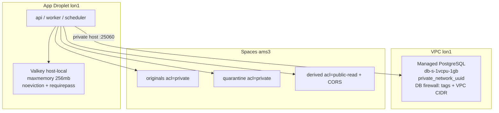

# TTW-064 — Managed data services (PostgreSQL, Valkey, Spaces)

DigitalOcean Managed PostgreSQL, host-local Valkey configuration, and Spaces
buckets for The Tamiym Workshop. Complements the TTW-062 network/edge
composition. **No live apply in this ticket** without an owner-held
`DIGITALOCEAN_TOKEN` (and Spaces keys for bucket apply).

**Region:** PostgreSQL in `lon1` (ADR-001). Spaces in `ams3` (Spaces is not
available in `lon1`; Amsterdam is the EU-near-London choice; `fra1` remains
recovery-aligned if needed).

## Topology



## Trust boundaries

| Boundary                         | Allowed                                    | Forbidden                                      |
| -------------------------------- | ------------------------------------------ | ---------------------------------------------- |
| Internet → Managed PostgreSQL    | Nothing public                             | `0.0.0.0/0` / `::/0` in DB firewall            |
| VPC / Droplet tags → PostgreSQL  | Labeling tags + VPC CIDR trusted sources   | World-open DB                                  |
| Host → Valkey                    | Loopback / internal Compose network + auth | Public `:6379`, `allkeys-lru`, empty password  |
| Browser → Spaces originals/quar. | Never (private ACL; app-signed URLs only)  | `acl = public-read` on originals or quarantine |
| Browser → Spaces derived         | GET/HEAD from allowlisted HTTPS origins    | Write from browsers without app mediation      |

Policy: `infra/policy/assert-data-invariants.sh` (from `validate-all.sh`).

## Modules

| Module                        | Role                                                                               |
| ----------------------------- | ---------------------------------------------------------------------------------- |
| `infra/modules/postgres`      | `digitalocean_database_cluster` (`engine=pg`, size `db-s-1vcpu-1gb`) + DB firewall |
| `infra/modules/spaces`        | Three buckets: originals, quarantine, derived                                      |
| `infra/modules/valkey_config` | Contract outputs + path to runtime conf (not a DO managed resource)                |
| `infra/runtime/valkey/`       | `valkey.conf` + Compose snippet for TTW-063                                        |

### PostgreSQL notes

- Provider engine slug is **`pg`** (not the string `postgres`).
- DigitalOcean Terraform provider **has no `deletion_protection` attribute**.
  Production sets `deletion_protection = true`, which selects a resource with
  `lifecycle { prevent_destroy = true }`. Temporary-validation sets `false`
  for destroy-friendly cleanup.
- Default version **16** (matches local Compose `postgres:16-alpine`).
- Private connectivity via `private_network_uuid = vpc_uuid`.
- Firewall rules: Droplet **tags** from labeling plus VPC **CIDR** as `ip_addr`.

### Spaces notes

- Prefer **three buckets** over one multi-prefix bucket so a mistaken
  `public-read` ACL cannot expose originals/quarantine.
- Versioning enabled; `force_destroy` only on temporary-validation.
- Derived bucket CORS limited to the env’s public HTTPS origins.

### Valkey notes

- Host-local on the Droplet (ADR: no managed Valkey at launch).
- `maxmemory 256mb`, `maxmemory-policy noeviction`, `requirepass` from
  `VALKEY_PASSWORD` (TTW-065 secrets).
- Compose snippet binds `127.0.0.1:6379` only.
- Upgrade trigger documented in module output `managed_upgrade_trigger`.

## Outputs (envs)

| Output                         | Meaning                              |
| ------------------------------ | ------------------------------------ |
| `postgres_id` / `private_host` | Managed PG identity and VPC hostname |
| `postgres_deletion_protection` | `true` prod / `false` tmpval         |
| `spaces_buckets`               | Map originals / quarantine / derived |
| `valkey_maxmemory` / policy    | Host Valkey contract for TTW-063     |

## Apply (owner-gated)

1. Export `DIGITALOCEAN_TOKEN` and Spaces keys (`SPACES_ACCESS_KEY_ID` /
   `SPACES_SECRET_ACCESS_KEY`) from the owner secret store — never commit.
2. Copy `backend.hcl.example` → `backend.hcl`, `terraform.tfvars.example` →
   `terraform.tfvars` as needed.
3. Prefer temporary-validation first: `tofu plan` → apply → evidence → destroy.
4. Production apply only after plan review; deletion protection prevents
   accidental destroy via OpenTofu.

Credential rotation and least-privilege DB/Spaces users: **TTW-065**.
Backup/restore drills: **TTW-067**. Droplet Compose wiring: **TTW-063**.

## Validate (no credentials)

```bash
export PATH="$HOME/.local/bin:$PATH"
pnpm infra:validate
# or: bash infra/scripts/validate-all.sh
```
